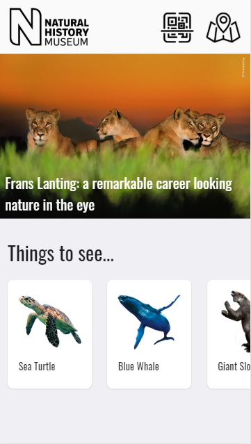

# NHM Companion Prototype

This is a Prototype app built for my U10 coursework. The final solution of my app sets to solve three of the problems I identified from research at the museum and speaking to the client representative: encouraging deeper interactions with artefacts, providing users with more information and helping users navigate the museum. 

## Design

My initial design documentation is in the form of an Adobe Xd document. See it for yourself at: https://xd.adobe.com/view/6a8a1934-7ad5-4fba-7fbd-d8bfa46771d8-1cbb/?hints=off 

### Content

The home page contains a few of the top artefacts and article content from the NHM website. From here, the user can browse artefacts, or scan QR codes attached to information boards by exhibits. A map is also available from all pages of the app.

This page contains more information such as further reading, the Vulnerability Status of the animal, and relevant videos.

### Additional pages

As this is a prototype, the functionality of these pages has not been implemented, although their integration has been demonstrated. The map (right) and QR page (left) are accessible from the top bar throughout the app.

# Technical Specification

The app is a web app, although a full implementation would be as a PWA,and is designed to look and feel like a native app, thanks to Onsen UI.

- Onsen UI - for styling the UI to look and feel like a native app
- JQuery - for speeding up development and shortening code
- Flickity - API for creating item carousels
- A-FRAME - for creating mixed reality environments in web browsers
- AR.js - enables us to create an AR environment within A-FRAME

# Limitations 

## Technical

The visual layout has been optimised for an iPhone 6/7/8, and the AR elements are only supported on iOS versions > 11. In addition, only certain mobile browsers are supported, including Safari and Chrome. See the [full list of supported browsers.](https://github.com/jeromeetienne/AR.js/blob/master/README.md#browser-support)

## Social 

One of the risks of this proposal is that the app may take away from the experience of the museum as people are constantly on their phones. To prevent this I propose that in full implementation, the app is used as an additional layer to the experience, rather than a way to experience the museum. The app should largely require navigating the museum to use its functionality, especially the AR. 

Additionally, the existence of the app means that people require a phone, which many people may not have. For older people and those with potentially lower cognitive accessibility, the app and its AR components may cause difficulty.